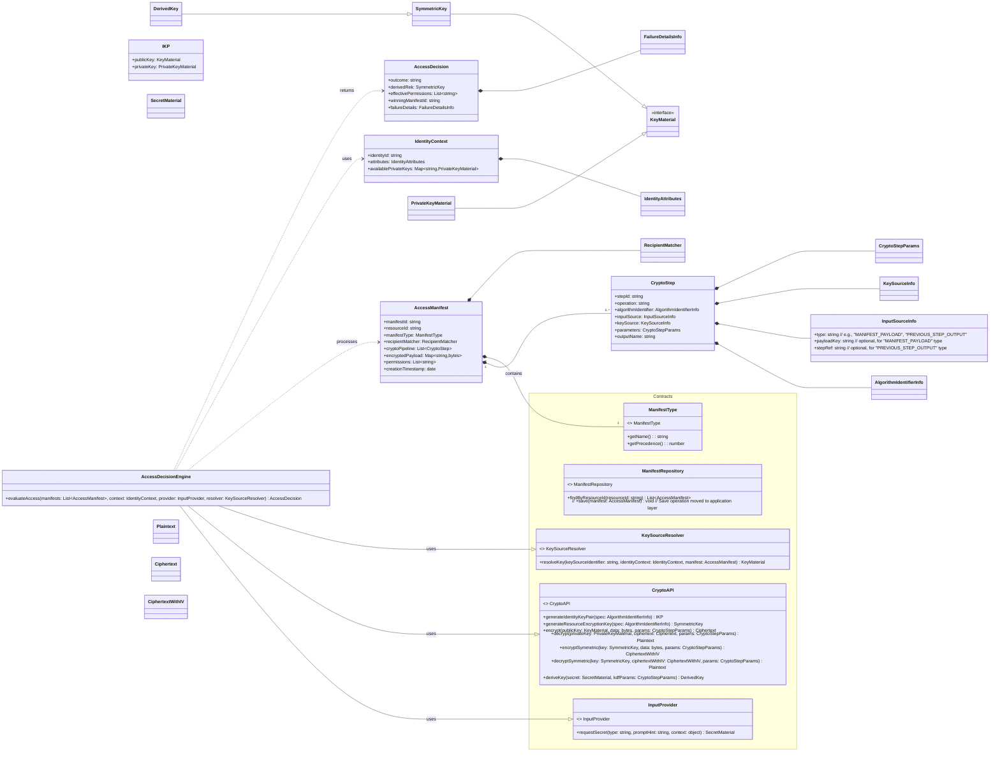
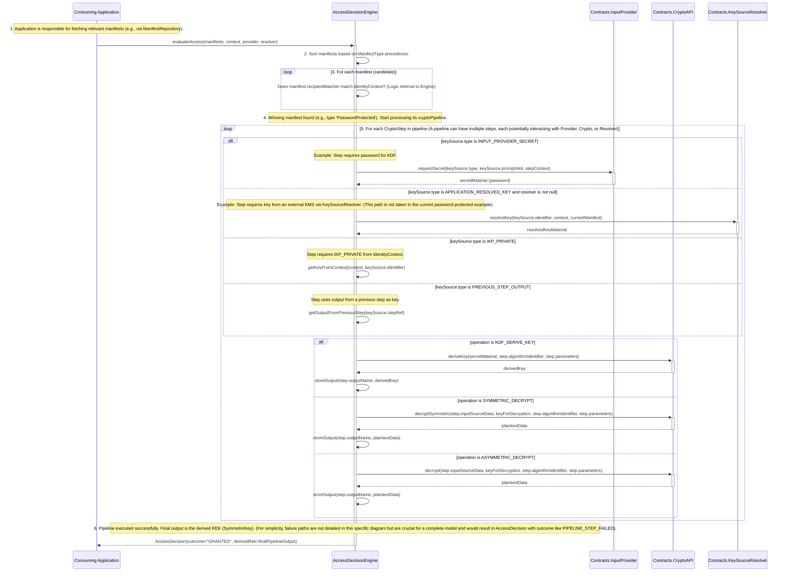
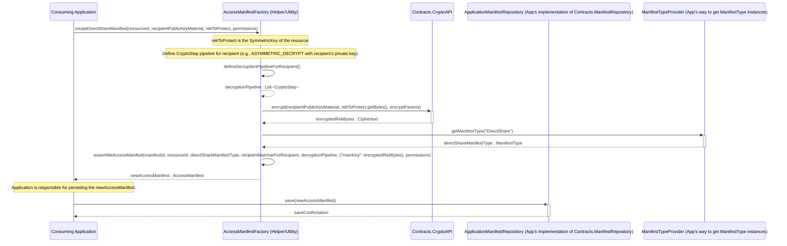
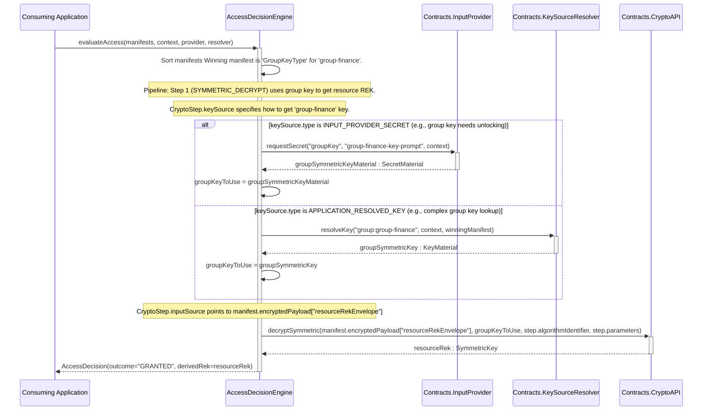
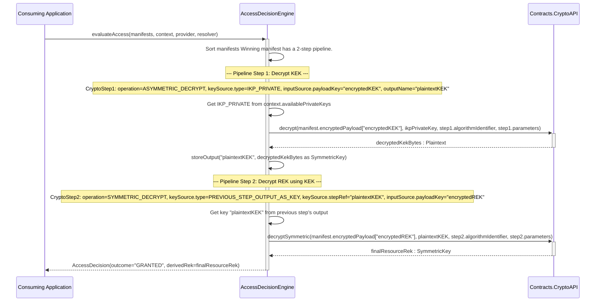
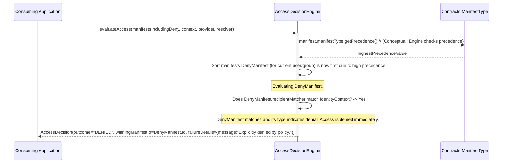

# FAC - UML Diagrams (Conceptual)
 
This document contains conceptual UML diagrams for the Cryptographic Access Framework (FAC) to visualize its core components and interactions.
 
## 1. Simplified Class Diagram
 
This diagram focuses on the main classes/interfaces and their primary relationships, incorporating detailed feedback.
 

 
## 2. Sequence Diagram: `evaluateAccess` Flow (Password-Protected Example)
 
**Description:** This diagram details the collaboration for accessing a resource protected by a password. The `AccessDecisionEngine` processes a manifest of a type like "PasswordProtected". The key for decryption is derived from a password obtained via the `InputProvider`.
**Use Case:** A user attempts to access a file or secret that they (or someone else) previously protected with a password. The user will be prompted for this password during the access attempt.
 

 
## 3. Sequence Diagram: Manifest Creation (Enveloping/Write Path)
 
**Description:** This diagram illustrates the "inverse operation" or "enveloping phase" of creating an `AccessManifest` to grant a specific type of access to a resource (e.g., direct share using a recipient's public key). It assumes a helper service or component within the consuming application, or a dedicated FAC utility module (e.g., `AccessManifestFactory`), orchestrates this process. The application remains responsible for persisting the created manifest.
**Use Case:** An application user wants to share a file with another user ("Bob"). The application needs to create an `AccessManifest` that encrypts the file's REK with Bob's public key and defines the decryption steps Bob's client will perform.
 

 
## 4. Component Diagram (High-Level Architecture)
 
**Description:** This diagram shows the major conceptual modules of the FAC and their primary dependencies. "Impl" modules represent potential concrete implementations that a consuming application might provide or use.
**Objective:** To visually represent the modular and layered structure of the FAC, highlighting the separation of concerns (API, core logic, implementation).
 
```mermaid
C4Context
    [fac-common] <<Library>>
    [fac-crypto-api] <<Library>>
    [fac-manifest-api] <<Library>>
    [fac-manifest-engine-core] <<Library>>

    [fac-crypto-impl-bouncycastle] <<Example Implementation>>
    [fac-manifest-persistence-api] <<Library>> // Interface defined by FAC
    [app-manifest-persistence-impl] <<Application Implementation>> // App implements persistence
    [fac-group-management-api] <<Library>> // Optional module
    [fac-group-management-impl-example] <<Example Implementation>> // Optional

    [Consuming Application] <<Application>>

    [fac-manifest-engine-core] --> [fac-manifest-api]
    [fac-manifest-engine-core] --> [fac-crypto-api]
    [fac-manifest-engine-core] --> [fac-common]

    [fac-manifest-api] --> [fac-common]
    [fac-crypto-api] --> [fac-common]

    [fac-crypto-impl-bouncycastle] ..|> [fac-crypto-api] : implements
    [app-manifest-persistence-impl] ..|> [fac-manifest-persistence-api] : implements
    [fac-manifest-persistence-api] --> [fac-manifest-api] // Persistence API needs to know about AccessManifest structure

    [fac-group-management-api] --> [fac-common]
    [fac-group-management-api] --> [fac-crypto-api] // For group key operations
    [fac-group-management-api] --> [fac-manifest-api] // For creating group key envelopes/manifests
    [fac-group-management-impl-example] ..|> [fac-group-management-api] : implements

    [Consuming Application] --> [fac-manifest-engine-core]
    [Consuming Application] --> [fac-manifest-persistence-api] // App uses this interface, provides impl
    [Consuming Application] --> [fac-crypto-api] // App might use crypto primitives directly
    [Consuming Application] --> [fac-group-management-api] // App uses group management

```
 
## 5. Sequence Diagram: `evaluateAccess` - Group Key Scenario
 
**Description:** This diagram illustrates how the `AccessDecisionEngine` evaluates access when the winning manifest is of a type like `GroupKeyType`. The group's symmetric key is required to decrypt the manifest's payload, which in turn contains the resource's REK (encrypted with the group key).
**Use Case:** A user attempts to access a resource shared with a group they are a member of. The FAC needs to obtain the group's symmetric key to ultimately decrypt the resource's REK. This key might be fetched via `InputProvider` (e.g., if it needs to be unlocked per session) or `KeySourceResolver` (for more complex group key management).
 

 
## 6. Sequence Diagram: `evaluateAccess` - KEK Wrapping Scenario
 
**Description:** This diagram shows a multi-step cryptographic pipeline where a Key Encryption Key (KEK) is used to wrap the final Resource Encryption Key (REK). First, the KEK is decrypted (e.g., using the user's IKP private key), and then the plaintext KEK is used as the key in a subsequent step to decrypt the REK. This illustrates the `PREVIOUS_STEP_OUTPUT_AS_KEY` mechanism.
**Use Case:** A resource's REK is protected by a KEK for an additional layer of security or for specific key management reasons. The KEK itself is protected by the user's asymmetric key pair.
 

 
## 7. Sequence Diagram: `evaluateAccess` - Explicit Deny Scenario
 
**Description:** This diagram illustrates how an `AccessManifest` of a type signifying explicit denial (e.g., `DenyUserType`, `DenyGroupType`) with high precedence short-circuits the evaluation process. If such a manifest matches the user, access is immediately denied without processing further manifests or cryptographic pipelines.
**Use Case:** An administrator explicitly revokes a user's or group's access to a specific resource. This denial must take precedence over any existing grants.
 

